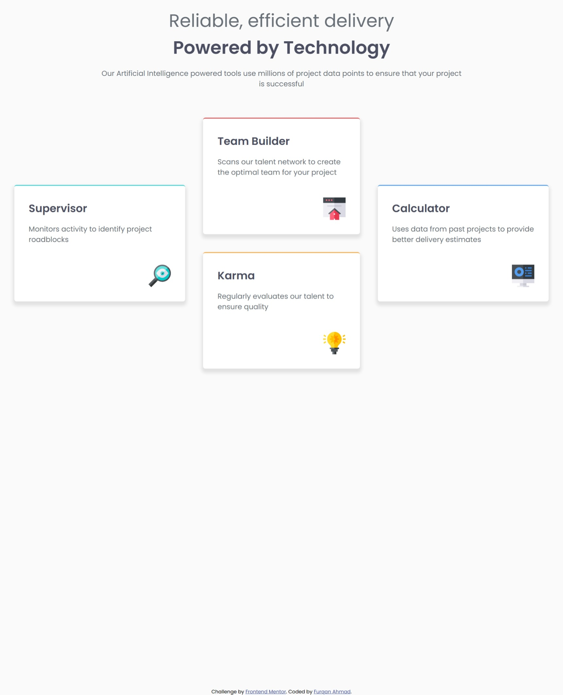

# Frontend Mentor - Four card feature section solution

This is a solution to the [Four card feature section challenge on Frontend Mentor](https://www.frontendmentor.io/challenges/four-card-feature-section-weK1eFYK). Frontend Mentor challenges help you improve your coding skills by building realistic projects. 

## Table of contents

- [Overview](#overview)
  - [The challenge](#the-challenge)
  - [Screenshot](#screenshot)
  - [Links](#links)
- [My process](#my-process)
  - [Built with](#built-with)
  - [What I learned](#what-i-learned)
- [Author](#author)

**Note: Delete this note and update the table of contents based on what sections you keep.**

## Overview
This is another challenge from frontendmentor.io in which we have to design a four cards feature section. This is implemented using pure HTML and CSS only.

### Screenshot

### Links

- Solution URL: [Click here](https://github.com/furqan7m3-ops/four-card-feature-section.git)
- Live Site URL: [Click here](https://four-card-feature-section-beta-roan.vercel.app/)

## My process

### Built with

- Semantic HTML5 markup
- CSS custom properties
- Flexbox
- CSS Grid
- Desktop-first workflow

### What I learned

I learned that we should use grid layout for 2d and flexbox for 1d layouts

- Frontend Mentor - [@Furqan Ahmad](https://www.frontendmentor.io/profile/furqan7m3-ops)
